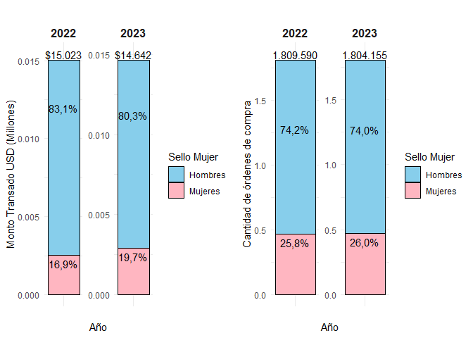
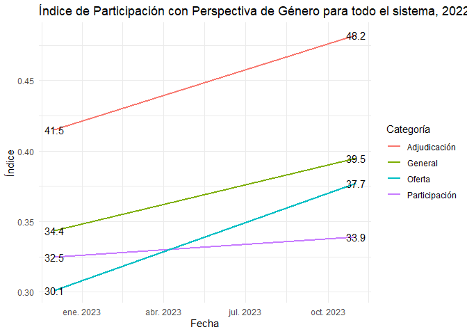

Cuaderno de Laboratorio: Índice de Participación con Perspectiva de
Género
================

## Motivación

En el marco de la evolución y modernización de las políticas públicas en
Chile, la Dirección de Compras y Contratación Pública (ChileCompra) tomó
la iniciativa de fortalecer su enfoque en la igualdad de género a través
de la actualización de la Directiva N°20 en noviembre de 2022. Este paso
estratégico representa un compromiso institucional con la promoción de
la equidad, marcando el inicio de una serie de acciones destinadas a
potenciar la participación de mujeres en el ámbito de las compras
públicas.

Un hito clave derivado de esta actualización es la automatización de la
entrega del Sello Empresa Mujer. Este distintivo, otorgado a las
empresas proveedoras que cumplen con criterios específicos, no solo
reconoce el compromiso con la igualdad de género, sino que también actúa
como un catalizador para estimular prácticas empresariales inclusivas y
generar un impacto positivo en la participación femenina en el sector.

La actualización de la directiva no solo responde a una necesidad
institucional, sino que también refleja un compromiso más amplio con la
construcción de una sociedad más equitativa. Se reconoce que la
autonomía de la mujer en sus decisiones físicas, educativas y económicas
es un pilar crucial para lograr igualdad de oportunidades. Por ende, de
allí que la promoción de la participación activa de mujeres en el ámbito
de las compras públicas se presenta como un componente estratégico en el
fomento de la autonomía económica de este segmento de…. la población.

En este contexto, el objetivo general de la propuesta se define con
claridad: desarrollar e implementar un indicador que no solo mida la
participación de mujeres como proveedoras en el sistema de compras
públicas de Chile, sino que también tenga como propósito evaluar y
promover la equidad de género en todas las etapas del proceso. Este
indicador no solo será un instrumento de medición, sino también una
herramienta activa para contribuir a la autonomía económica de las
mujeres, respaldando así la visión de una sociedad más inclusiva y
equitativa.

De esta manera, es posible caracterizar el sistema de compras públicas
un conjunto de indicadores derivados de información transaccional
generada dentro de Mercado Público, así como en datos complementarios y
oficiales proporcionados por otros organismos públicos. Entre estos
últimos, destaca la información suministrada por el Registro Civil, que
incluye datos desglosados por género de cada persona, contribuyendo así
a una visión más completa y específica de la participación de mujeres en
este ámbito.

La aplicación y monitoreo periódico de estos indicadores permiterá una
caracterización directa y sencilla del subconjunto de compras en el que
participan las empresas lideradas por mujeres. En consonancia con los
lineamientos establecidos en la Directiva N°20 de compras, se define que
una empresa es liderada por mujeres y, por ende, cumple con los
requisitos para obtener el Sello Mujer si satisface alguno de los
siguientes criterios:

- Poseer más del 50% de propiedad en manos de mujeres.
- Contar con una gerenta general.
- Tener más del 50% de representantes legales mujeres.
- En el caso de personas naturales, la definición se basa en la
  información proporcionada por el Registro Civil, incluyendo a aquellas
  personas que han rectificado su sexo registral de acuerdo con la Ley
  Nº 21.120 de Identidad de Género, identificándose como mujeres.

Es relevante destacar que estos requisitos son sometidos a revisión
mediante la declaración jurada presentada por los propios proveedores y
proveedoras cada año, garantizando así la validez y actualización de la
información.

## Caracterización de empresas con Sello Mujer

Esta sección se centra en la caracterización del sistema de compras
públicas a través de dos métricas fundamentales: la cantidad de órdenes
de compra y el monto total transado. Estos indicadores se explorarán
específicamente en el contexto de las empresas que han obtenido el Sello
Mujer, ofreciendo una visión analítica que revela tanto patrones de
participación como la contribución económica relativa de estas empresas
al sistema en su conjunto

<!-- -->

Este gráfico revela que, aunque las variaciones en la cantidad de
órdenes de compra y montos transados entre ambos períodos son mínimas,
se observa una mejora sutil en la participación en los montos. Esta
mejora es evidente al pasar del 17% en 2022 al 19.7% para las mujeres.
Es especialmente notable considerando que, a pesar de que el año 2023
aún no ha concluido, se aprecia un volumen total transado muy similar al
año anterior.

## Monto y cantidad de órdenes de compra según procedimiento de compra

<!-- -->

 Aunque es interesante realizar una apertura
por procedimiento de compra, este gráfico no refleja adecuadamente la
realidad pues no puede ser que el % de participación de las empresas
lideradas por mujeres sea inferior en todos los procedimientos de compra
en relación con el total. Por lo tanto debo verificar que la query está
bien construida. Revisar archivo ‘indicadores_complementarios_20231213’

## Instituciones según importancia de empresas lideradas por mujeres

<!-- -->

Frente al hecho de que nuestro indicador puede arrojar valores no
*convencionales* cuando una institución emite pocas órdenes de compra,
es que decidimos realizar un zoom a aquellas instituciones en que
podemos observar que del total de órdenes de compra, el porcentaje
asignado a empresas lideradas por mujeres es mayor que la media y
asimismo, aquellas en que el porcentaje asignado en términos de montos
es superior a la media. Este criterio nos permitió identificar aquellas
empresas que pertenecen al cuadrante 1.

## Los principales compradores del primer cuadrante para las empresas con Sello Mujer

<!-- -->

Posteriormente, procedimos a mostrar un ranking de aquellas
instituciones pertenecientes al cuadrante 1, en la que identificamos que
en materia de montos destacan los municipios, mientras que en materia de
cantidad de órdenes de compra, el ranking parece estar liderada por
instituciones del sector salud.

Este es un hallazgo interesante en el que se puede profundizar más
adelante.

## Cantidad y Tasa de Participación de proveedoras en el sistema

<!-- -->

De este cuadro se desprende que entre los años 2022 y 2023 se puede
apreciar un aumento importante de proveedores activos en general en
Mercado Público, con un aumento del 43% al pasar de 96.434 en 2022 a
138.509 en 2023.

Sin embargo, se aprecia que el aumento de empresas proveedoras lideradas
por hombres es mayor al aumento de emmpresas lideradas por mujeres, pues
las primeras experimentaron un aumento de un orden de 47% mientras que
las segundas en un orden de 32%

## Propuesta

- El indice que proponemos, siguiendo de cerca el trabajo de
  Permanyer (2010) es el siguiente:

$$
IPPG_{t}^{i} = \sqrt[n_{j}]{\prod_{j=1}^{n_{j}}R_{j,t}^{i}}
$$

Donde: $$
 R_{j,t}^{i} = \frac{P_{M,j,t}^{i}}{P_{H,j,t}^{i}} 
  $$

En que $i=1,...,M$ corresponde a las instituciones del Estado;
$j = 1,..,n_{j}$, corresponde a las dimensiones a considerar; $t=1,..,T$
identifica la dimensión tiempo, por último, el subíndice $M$ a las
empresas lideradas por mujeres y $H$, aquellas lideradas por hombres

## Propuesta

En este caso, $R_{j,t}^{i}$ es un odds ratio para cada una de las etapas
del proceso de participación, representando por tanto la razón entre las
probabilidades tanto de hombres como mujeres en las diferentes etapas
del proceso, es decir, las chance de:

- Participar en Mercado Público: Medida como la razón entre el número de
  empresas lideradas por mujeres y aquellas lideradas por hombres
  inscritas en la plataforma.
- Ofertar en algún procedimiento de compra: Razón entre empresas
  lideradas por mujeres y por hombres que ofertan en licitaciones,
  compra ágil, convenio marco, etc.
- Recibir una orden de compra: Razón entre el número de empresas
  lideradas por mujeres y por hombres, que reciben una orden de compra

## Resultados preliminares

El índice tiene como rango valores entre 0 e $\infty$, valores mayores a
1 indican una mayor preferencia por la contratación de empresas
lideradas por mujeres, mientras que un valor cercano a 0 una mayor
preferencia por empresas lideradas por hombres

<!-- -->

En esta figura se puede apreciar que existe una mejora en términos de
cada una de las dimensiones bajo análisis (participación, oferta y
adjudicación), pero que ha sido más pronunciado en algunas dimensiones
que en otras, eb esa línea, el cambio más discreto ocurre en el ratio de
participación, pasando desde 32.4 a 33.8 que significa una variación de
4.3%. En materia de oferta, el índice pasa de 29.8 a 37.3, un aumento
del 25,2%, es decir, la dimensión que más crece, pues en el caso de la
adjudicación, observamos que pasa desde 41.2 a 47.4, representando un
aumento de 15%.

Con todo, podemos observar que el índice general pasa de 34.2 a 39.1, es
decir una variación de 14.3%

Este es un hallazgo interesante pues apreciamos que aunque existe un
brusco aumento de la oferta, muchas de ellas no se materializan en una
adjudicación

<!-- -->

## Resultados preliminares

## Resultados preliminares

<!-- -->

## Agenda

- Determinar la capacidad discriminativa del indicador realizando cruces
  adicionales de información

- Analizar la evolución del fenómeno mediante la construcción de un
  índice de carácter temporal

- Automatizar la rutina de cálculo del índice para asegurar su
  oportunidad

- Identificar posibles variables que permitan explicar el comportamiento
  del índice y de esta manera comprender las razones del fenómeno
