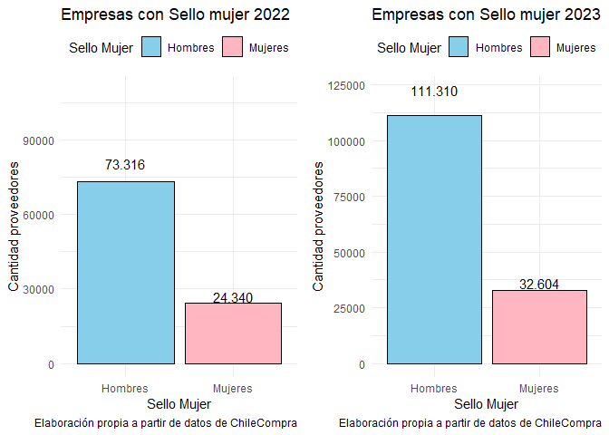
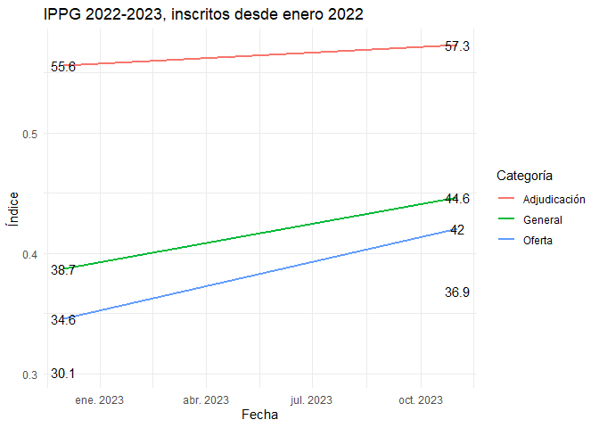
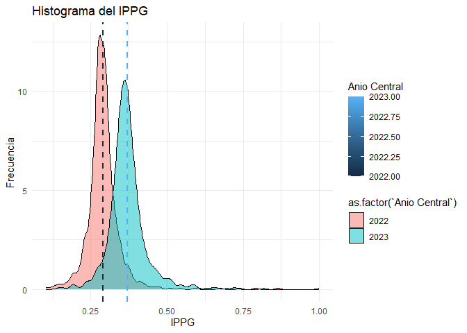

Cuaderno de Laboratorio: Índice de Participación con Perspectiva de
Género
================

Un **cuaderno de investigación**, también conocido como cuaderno de
laboratorio o cuaderno de campo, es un documento utilizado por
investigadores para registrar de manera sistemática y detallada todas
las etapas y aspectos de un proyecto de investigación. Este cuaderno
sirve como un registro permanente de las observaciones, experimentos,
resultados, análisis y cualquier otro dato relevante asociado con la
investigación.

## ChileCompra

 Estos bullets se usaron para la presentación
realizada con funcionarias del ministerio de hacienda, por tanto, se
consideró necesario hacer un recordatorio del quehacer del servicio, sin
embargo, para uso interno es prescindible 

- La Dirección de Compras y Contratación Pública, Dirección ChileCompra
  es una entidad clave para más de 1.000 organismos públicos en Chile,
  facilitando la adquisición de bienes y servicios. A través de su
  plataforma transaccional, [Mercado
  Público](https://www.mercadopublico.cl).

- En 2022 las transacciones de organismos del Estado a través de la
  plataforma de ascendieron a más de **US\$ 15.000 millones**, cerca del
  5% del PIB, a través de más de 1.800.000 órdenes de compra, siendo uno
  de los mercados más importantes del país.

- Hoy fue promulgada la modernización de la Ley de Compras Públicas, con
  el objetivo de mejorar la calidad del gasto, elevar la probidad y
  transparencia, e integrar principios de economía circular.

## Motivación

La Dirección ChileCompra actualizó su directiva incorporando perspectiva
de género en las compras públicas, buscando abordar desigualdades y
roles de género para promover una sociedad más equitativa.

- La autonomía de la mujer, clave para su independencia en decisiones
  físicas, educativas y económicas, destaca como pilar crucial para
  lograr igualdad de oportunidades.

- La autonomía económica de las mujeres haya apoyo estratégico en las
  compras públicas, ofreciendo oportunidades y contribuyendo a su
  independencia financiera.

- De allí que el **Objetivo General** de esta propuesta consiste en
  **desarrollar e implementar un indicador para medir la participación
  de mujeres como proveedoras en el sistema de compras públicas** de
  Chile, con el propósito de evaluar y promover la equidad de género en
  las distintas etapas del proceso y contribuir a la autonomía económica
  de las mujeres.

## Contexto: Empresas lideradas por mujeres según Monto transado y órdenes de compra

<!-- -->

Este gráfico muestra que aunque no hay variaciones importantes entre
ambos períodos entre cantidad de órdenes de compra y montos transados,
sí se puede apreciar una leve mejora en términos de participación en los
montos pasando de un 17% en 2022 para las mujeres a un 19,7%, sobre todo
si se tiene en cuenta que a pesar de que el año 2023 no ha concluido, se
aprecia un total transado muy similar al año anterior.

## Monto y cantidad de órdenes de compra según procedimiento de compra

<!-- -->

 Aunque es interesante realizar una apertura
por procedimiento de compra, este gráfico no refleja adecuadamente la
realidad pues no puede ser que el % de participación de las empresas
lideradas por mujeres sea inferior en todos los procedimientos de compra
en relación con el total. Por lo tanto debo verificar que la query está
bien construida. Revisar archivo ‘indicadores_complementarios_20231213’

## Instituciones según importancia de empresas lideradas por mujeres

<!-- -->

Frente al hecho de que nuestro indicador puede arrojar valores no
*convencionales* cuando una institución emite pocas órdenes de compra,
es que decidimos realizar un zoom a aquellas instituciones en que
podemos observar que del total de órdenes de compra, el porcentaje
asignado a empresas lideradas por mujeres es mayor que la media y
asimismo, aquellas en que el porcentaje asignado en términos de montos
es superior a la media. Este criterio nos permitió identificar aquellas
empresas que pertenecen al cuadrante 1.

## Los principales compradores del primer cuadrante para las empresas con Sello Mujer

<!-- -->

Posteriormente, procedimos a mostrar un ranking de aquellas
instituciones pertenecientes al cuadrante 1, en la que identificamos que
en materia de montos destacan los municipios, mientras que en materia de
cantidad de órdenes de compra, el ranking parece estar liderada por
instituciones del sector salud.

Este es un hallazgo interesante en el que se puede profundizar más
adelante.

## Cantidad y Tasa de Participación de proveedoras en el sistema

<!-- -->

De este cuadro se desprende que entre los años 2022 y 2023 se puede
apreciar un aumento importante de proveedores activos en general en
Mercado Público, con un aumento del 43% al pasar de 96.434 en 2022 a
138.509 en 2023.

Sin embargo, se aprecia que el aumento de empresas proveedoras lideradas
por hombres es mayor al aumento de emmpresas lideradas por mujeres, pues
las primeras experimentaron un aumento de un orden de 47% mientras que
las segundas en un orden de 32%

## Propuesta

- El indice que proponemos, siguiendo de cerca el trabajo de
  Permanyer (2010) es el siguiente:

$$
IPPG_{t}^{i} = \sqrt[n_{j}]{\prod_{j=1}^{n_{j}}R_{j,t}^{i}}
$$

Donde: $$
 R_{j,t}^{i} = \frac{P_{M,j,t}^{i}}{P_{H,j,t}^{i}} 
  $$

En que $i=1,...,M$ corresponde a las instituciones del Estado;
$j = 1,..,n_{j}$, corresponde a las dimensiones a considerar; $t=1,..,T$
identifica la dimensión tiempo, por último, el subíndice $M$ a las
empresas lideradas por mujeres y $H$, aquellas lideradas por hombres

## Propuesta

En este caso, $R_{j,t}^{i}$ es un odds ratio para cada una de las etapas
del proceso de participación, representando por tanto la razón entre las
probabilidades tanto de hombres como mujeres en las diferentes etapas
del proceso, es decir, las chance de:

- Participar en Mercado Público: Medida como la razón entre el número de
  empresas lideradas por mujeres y aquellas lideradas por hombres
  inscritas en la plataforma.
- Ofertar en algún procedimiento de compra: Razón entre empresas
  lideradas por mujeres y por hombres que ofertan en licitaciones,
  compra ágil, convenio marco, etc.
- Recibir una orden de compra: Razón entre el número de empresas
  lideradas por mujeres y por hombres, que reciben una orden de compra

## Resultados preliminares

El índice tiene como rango valores entre 0 e $\infty$, valores mayores a
1 indican una mayor preferencia por la contratación de empresas
lideradas por mujeres, mientras que un valor cercano a 0 una mayor
preferencia por empresas lideradas por hombres

<!-- -->

En esta figura se puede apreciar que existe una mejora en términos de
cada una de las dimensiones bajo análisis (participación, oferta y
adjudicación), pero que ha sido más pronunciado en algunas dimensiones
que en otras, eb esa línea, el cambio más discreto ocurre en el ratio de
participación, pasando desde 32.4 a 33.8 que significa una variación de
4.3%. En materia de oferta, el índice pasa de 29.8 a 37.3, un aumento
del 25,2%, es decir, la dimensión que más crece, pues en el caso de la
adjudicación, observamos que pasa desde 41.2 a 47.4, representando un
aumento de 15%.

Con todo, podemos observar que el índice general pasa de 34.2 a 39.1, es
decir una variación de 14.3%

Este es un hallazgo interesante pues apreciamos que aunque existe un
brusco aumento de la oferta, muchas de ellas no se materializan en una
adjudicación

## Resultados preliminares

    ## Warning: The dot-dot notation (`..density..`) was deprecated in ggplot2 3.4.0.
    ## ℹ Please use `after_stat(density)` instead.
    ## This warning is displayed once every 8 hours.
    ## Call `lifecycle::last_lifecycle_warnings()` to see where this warning was
    ## generated.

## Resultados preliminares

<!-- -->

## Agenda

- Determinar la capacidad discriminativa del indicador realizando cruces
  adicionales de información

- Analizar la evolución del fenómeno mediante la construcción de un
  índice de carácter temporal

- Automatizar la rutina de cálculo del índice para asegurar su
  oportunidad

- Identificar posibles variables que permitan explicar el comportamiento
  del índice y de esta manera comprender las razones del fenómeno
