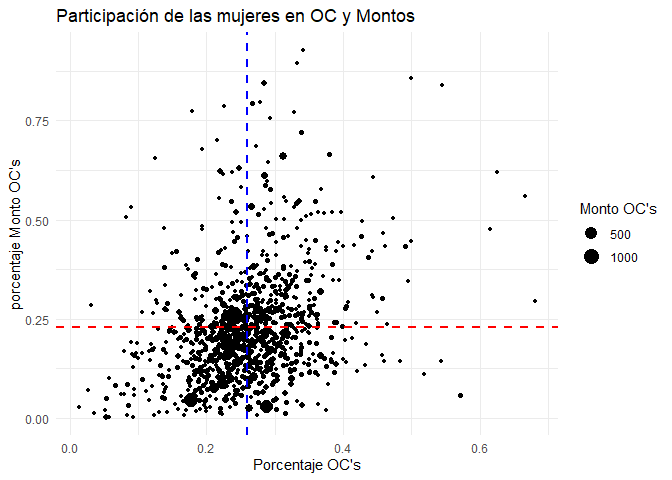

Cuaderno de Laboratorio: Índice de Participación con Perspectiva de
Género
================

# Introducción

En el marco de la evolución y modernización de las políticas públicas en
Chile, la Dirección de Compras y Contratación Pública (ChileCompra) tomó
la iniciativa de fortalecer su enfoque en la igualdad de género a través
de la actualización de la Directiva N°20 en noviembre de 2022. Este paso
estratégico representa un compromiso institucional con la promoción de
la equidad, marcando el inicio de una serie de acciones destinadas a
potenciar la participación de mujeres en el ámbito de las compras
públicas.

Un hito clave derivado de esta actualización es la automatización de la
entrega del Sello Empresa Mujer (En adelante Sello). Este distintivo,
otorgado a las empresas proveedoras que cumplen con criterios
específicos, no solo reconoce el compromiso con la igualdad de género,
sino que también actúa como un catalizador para estimular prácticas
empresariales inclusivas y generar un impacto positivo en la
participación femenina en el sector.

La actualización de la directiva no solo responde a una necesidad
institucional, sino que también refleja un compromiso más amplio con la
construcción de una sociedad más equitativa. Se reconoce que la
autonomía de la mujer en sus dimensiones es un pilar crucial para lograr
igualdad de oportunidades. Por ende, de allí que la promoción de la
participación activa de mujeres en el ámbito de las compras públicas se
presenta como un componente estratégico en el fomento de la autonomía
económica de este segmento de la población.

En este contexto, el objetivo general de la propuesta se define con
claridad: desarrollar e implementar un indicador que no solo mida la
participación de mujeres como proveedoras en el sistema de compras
públicas de Chile, sino que también tenga como propósito evaluar y
promover la equidad de género en todas las etapas del proceso. Este
indicador no solo será un instrumento de medición, sino también una
herramienta activa para contribuir a la autonomía económica de las
mujeres, respaldando así la visión de una sociedad más inclusiva y
equitativa.

Teniendo en cuenta lo anterior, en este documento se abordan algunos
resultados preliminares del Índice de Participación con Perspectiva de
Género en compras públicas (IPPG) junto con algunas métricas que buscan
caracterizar la participación diferenciada por sexo en el sistema.

# Caracterización de empresas según Sello Mujer

Esta sección se centra en la caracterización del sistema de compras
públicas a través de dos métricas fundamentales: la cantidad de órdenes
de compra y el monto total transado. Estos indicadores se exploran
específicamente diferenciando las empresas según el Sello Mujer,
ofreciendo una visión analítica que revela tanto patrones de
participación como la contribución económica relativa de estas empresas
al sistema en su conjunto.Cabe destacar de todas maneras, que esta
entrega incluye cifras preliminares, pues no se ha cerrado el año 2023,
por lo tanto, las estadísticas aquí presentadas consideran sólo datos
hasta el mes de noviembre, los que serán actualizados oportunamente.

De esta manera, es posible caracterizar el sistema de compras públicas
un conjunto de indicadores derivados de información transaccional
generada dentro de Mercado Público, así como en datos complementarios y
oficiales proporcionados por otros organismos públicos. Entre estos
últimos, destaca la información suministrada por el Registro Civil, que
incluye datos desglosados por género de cada persona, contribuyendo así
a una visión más completa y específica de la participación de mujeres en
este ámbito.

En consonancia con los lineamientos establecidos en la Directiva N°20 de
compras, se define que una empresa es liderada por mujeres y, por ende,
cumple con los requisitos para obtener el Sello Mujer si satisface
alguno de los siguientes criterios:

- Poseer más del 50% de propiedad en manos de mujeres.
- Contar con una gerenta general.
- Tener más del 50% de representantes legales mujeres.
- En el caso de personas naturales, la definición se basa en la
  información proporcionada por el Registro Civil, incluyendo a aquellas
  personas que han rectificado su sexo registral de acuerdo con la Ley
  Nº 21.120 de Identidad de Género, identificándose como mujeres.

Es relevante destacar que estos requisitos son sometidos a revisión
mediante la declaración jurada presentada por los propios proveedores y
proveedoras cada año, garantizando así la validez y actualización de la
información.

En primer lugar, analizaremos los montos transados y el número de
transacciones materializada a través de órdenes de compra para las
empresas proveedoras del sistema según Sello. La figura 1 revela que,
aunque las variaciones en la cantidad de órdenes de compra y montos
transados entre ambos períodos son mínimas , se observa una mejora sutil
en la participación en los montos. Esta mejora es evidente al pasar del
16,9% en 2022 al 19.7% para las mujeres en 2023. Es especialmente
notable considerando que, a pesar de que el año 2023 aún no ha
concluido, se aprecia una cantidad de transacciones muy similar al año
anterior (1.809.590 vs 1.804.155).

Montos transados y cantidad de órdenes de compra según Sello, 2022-2023

Empresas según sello, 2022-2023

La figura 2 por su parte, muestra un notable aumento en el número de
proveedores activos en Mercado Público entre los años 2022 y 2023,
registrando un incremento significativo del 47%. Este incremento se
traduce en un salto desde los 97.656 empresas a 143.914 empresas
proveedoras durante este período.

No obstante, es evidente que el crecimiento de las empresas lideradas
por hombres supera al de las empresas lideradas por mujeres. Mientras
que las primeras experimentaron un aumento del 51,8%, las segundas
experimentaron un incremento del 34%, reflejando así una diferencia en
las tasas de crecimiento entre ambos grupos

# Propuesta Metodológica

Tomando en cuenta que el proceso de compra abarca diversas etapas
previas a la emisión de una orden de compra, y que en cada una de estas
etapas existen indicadores que miden las brechas de género, presentamos
una metodología para construir un índice que evalúe la participación en
las compras públicas desde una mirada multidimensional. Este índice
proporciona una visión global, condensando las posibles diferencias en
un solo número para una interpretación más clara del progreso del
sistema en general como para cada organismo público.

El índice propuesto, siguiendo la línea de trabajo de Permanyer (2010),
se formula de la siguiente manera:

$$
IPPG_{t}^{i} = \sqrt[n_{j}]{\prod_{j=1}^{n_{j}}R_{j,t}^{i}}
$$

Donde: $$
 R_{j,t}^{i} = \frac{P_{M,j,t}^{i}}{P_{H,j,t}^{i}} 
  $$

En que $i=1,...,M$ corresponde a las instituciones del Estado;
$j = 1,..,n_{j}$, corresponde a las dimensiones a considerar; $t=1,..,T$
identifica la dimensión tiempo, por último, el subíndice $M$ a las
empresas lideradas por mujeres y $H$, aquellas lideradas por hombres

En este caso, $R_{j,t}^{i}$ es un odds ratio para cada una de las etapas
del proceso de participación, representando por tanto la razón entre las
probabilidades tanto de hombres como mujeres en las diferentes etapas
del proceso, en nuestrao caso, las chance de:

- Ofertar en algún procedimiento de compra: medido como la razón entre
  la cantidad de empresas lideradas por mujeres y por hombres que
  ofertan en licitaciones, compra ágil, convenio marco, etc.
- Recibir una orden de compra: Razón entre el número de empresas
  lideradas por mujeres y por hombres, que reciben órdenes de compra.

El índice solo toma valores positivos, mayores a cero, y puede tender
hacia el infinito según la desigualdad del proceso. Será igual a 1 en
caso de igualdad perfecta, superior a 1 si las empresas lideradas por
mujeres son favorecidas y menor a 1 si las empresas lideradas por
hombres lo son.

Finalmente, es crucial destacar que el índice propuesto penaliza
matemáticamente la inequidad de género por cada brecha adicional
detectada. En otras palabras, el índice tiende más rápidamente a cero
(desfavoreciendo a las mujeres) a medida que existen más ratios de
participación con inequidad.

# Resultados preliminares

En la Figura 3 se evidencia una mejora en cada una de las dimensiones
analizadas entre ambos años (oferta y adjudicación). En cuanto a la
dimensión de oferta, el índice experimenta un notorio incremento,
pasando de 0,3 a 0,39, lo que implica un crecimiento del 25,2%, siendo
esta la dimensión de mayor aumento. En el caso de la adjudicación, se
registra un aumento del 14,3%, pasando de 0,42 a 0,49.

A pesar de estos avances, el índice general muestra un incremento de
17,6%, pasando de 0,35 a 0,43. Este hallazgo es revelador, ya que señala
que, a pesar del significativo aumento en las ofertas, muchas de ellas
no se materializan en adjudicaciones.

Adicionalmente al índice calculado para el sistema en su conjunto, se
llevó a cabo el cálculo para cada organismo comprador del Estado. Esta
desagregación permite medir la evolución del fenómeno de manera más
detallada y específica.

Evolución del IPPG para Mercado Público, 2022-2023

La Figura 4 exhibe la distribución del índice para los años 2022 y 2023,
revelando una notable mejora en las oportunidades otorgadas a las
mujeres en el sistema. En este contexto, se observa un aumento
significativo, ya que la media por institución pasó de 0,29 en 2022 a
0,37 en 2023. Este avance se hace aún más evidente al analizar la
distribución completa, donde se percibe un desplazamiento significativo
por parte de muchas instituciones.

No obstante, es crucial señalar que esta mejora dista considerablemente
del ideal. Se ha incorporado, además, una distribución hipotética en
tono gris que representa cómo debería comportarse el indicador en
condiciones más equitativas. Esta distribución teórica se desplaza hacia
la derecha y se centra alrededor del valor 1, que indica igualdad de
oportunidades en el sistema.

Distribución del IPPG según organismos del Estado

<table class="table" style="font-size: 9px; margin-left: auto; margin-right: auto;">
<caption style="font-size: initial !important;">
Ranking organismos públicos, 2022-2023
</caption>
<thead>
<tr>
<th style="text-align:left;">
Organismo.comprador
</th>
<th style="text-align:right;">
Ratio.Oferta.2022
</th>
<th style="text-align:right;">
Ratio.Oferta.2023
</th>
<th style="text-align:right;">
Ratio.adjudicación.2022
</th>
<th style="text-align:right;">
Ratio.adjudicación.2023
</th>
<th style="text-align:right;">
IPPG.2022
</th>
<th style="text-align:right;">
IPPG.2023
</th>
</tr>
</thead>
<tbody>
<tr>
<td style="text-align:left;width: 3in; ">
CORPORACION MUNICIPAL DE LAS ARTES Y LA CULTURA DE RIO CLARO
</td>
<td style="text-align:right;">
</td>
<td style="text-align:right;">
1.00
</td>
<td style="text-align:right;">
</td>
<td style="text-align:right;">
1.00
</td>
<td style="text-align:right;">
</td>
<td style="text-align:right;">
1.00
</td>
</tr>
<tr>
<td style="text-align:left;width: 3in; ">
CORPORACIÓN MUNICIPAL DE DEPORTES DE CALDERA
</td>
<td style="text-align:right;">
0.65
</td>
<td style="text-align:right;">
0.67
</td>
<td style="text-align:right;">
0.33
</td>
<td style="text-align:right;">
1.00
</td>
<td style="text-align:right;">
0.46
</td>
<td style="text-align:right;">
0.82
</td>
</tr>
<tr>
<td style="text-align:left;width: 3in; ">
CORPORACIÓN MUNICIPAL DE DEPORTES Y RECREACIÓN PANGUIPULLI
</td>
<td style="text-align:right;">
</td>
<td style="text-align:right;">
0.60
</td>
<td style="text-align:right;">
</td>
<td style="text-align:right;">
0.88
</td>
<td style="text-align:right;">
</td>
<td style="text-align:right;">
0.72
</td>
</tr>
<tr>
<td style="text-align:left;width: 3in; ">
CORPORACION CULTURAL MUNICIPAL DE LOS ANGELES
</td>
<td style="text-align:right;">
</td>
<td style="text-align:right;">
0.52
</td>
<td style="text-align:right;">
</td>
<td style="text-align:right;">
1.00
</td>
<td style="text-align:right;">
</td>
<td style="text-align:right;">
0.72
</td>
</tr>
<tr>
<td style="text-align:left;width: 3in; ">
CORPORACION CULTURAL DE LA ILUSTRE MUNICIPALIDAD DE VALDIVIA
</td>
<td style="text-align:right;">
</td>
<td style="text-align:right;">
0.66
</td>
<td style="text-align:right;">
</td>
<td style="text-align:right;">
0.73
</td>
<td style="text-align:right;">
</td>
<td style="text-align:right;">
0.69
</td>
</tr>
<tr>
<td style="text-align:left;width: 3in; ">
CORPORACION MUNICIPAL DE DEPORTES DE LA PINTANA
</td>
<td style="text-align:right;">
</td>
<td style="text-align:right;">
0.50
</td>
<td style="text-align:right;">
</td>
<td style="text-align:right;">
0.88
</td>
<td style="text-align:right;">
</td>
<td style="text-align:right;">
0.66
</td>
</tr>
<tr>
<td style="text-align:left;width: 3in; ">
CORPORACION MUNICIPAL DEL DEPORTE DE LAMPA
</td>
<td style="text-align:right;">
</td>
<td style="text-align:right;">
0.43
</td>
<td style="text-align:right;">
</td>
<td style="text-align:right;">
1.00
</td>
<td style="text-align:right;">
</td>
<td style="text-align:right;">
0.66
</td>
</tr>
<tr>
<td style="text-align:left;width: 3in; ">
CENTRO DE SALUD FAMILIAR CESFAM LLAY LLAY
</td>
<td style="text-align:right;">
0.34
</td>
<td style="text-align:right;">
0.45
</td>
<td style="text-align:right;">
0.76
</td>
<td style="text-align:right;">
0.93
</td>
<td style="text-align:right;">
0.51
</td>
<td style="text-align:right;">
0.65
</td>
</tr>
<tr>
<td style="text-align:left;width: 3in; ">
CORPORACION MUNICIPAL DE DEPORTES DE PADRE LAS CASAS
</td>
<td style="text-align:right;">
0.62
</td>
<td style="text-align:right;">
0.55
</td>
<td style="text-align:right;">
1.20
</td>
<td style="text-align:right;">
0.71
</td>
<td style="text-align:right;">
0.86
</td>
<td style="text-align:right;">
0.63
</td>
</tr>
<tr>
<td style="text-align:left;width: 3in; ">
CORPORACION MUNICIPAL DE DESARROLLO ECONOMICO CULTURA Y DEPORTES DE RE
</td>
<td style="text-align:right;">
0.70
</td>
<td style="text-align:right;">
0.49
</td>
<td style="text-align:right;">
0.20
</td>
<td style="text-align:right;">
0.73
</td>
<td style="text-align:right;">
0.37
</td>
<td style="text-align:right;">
0.60
</td>
</tr>
<tr>
<td style="text-align:left;width: 3in; ">
CORPORACION MUNICIPAL DE DEPORTES Y RECREACIÓN DE ANTOFAGASTA
</td>
<td style="text-align:right;">
</td>
<td style="text-align:right;">
0.58
</td>
<td style="text-align:right;">
</td>
<td style="text-align:right;">
0.60
</td>
<td style="text-align:right;">
</td>
<td style="text-align:right;">
0.59
</td>
</tr>
<tr>
<td style="text-align:left;width: 3in; ">
MINISTERIO DE LA MUJER Y LA EQUIDAD DE GÉNERO
</td>
<td style="text-align:right;">
0.34
</td>
<td style="text-align:right;">
0.46
</td>
<td style="text-align:right;">
0.43
</td>
<td style="text-align:right;">
0.76
</td>
<td style="text-align:right;">
0.38
</td>
<td style="text-align:right;">
0.59
</td>
</tr>
<tr>
<td style="text-align:left;width: 3in; ">
SERVICIO LOCAL DE EDUCACIÓN PÚBLICA AYSÉN
</td>
<td style="text-align:right;">
0.13
</td>
<td style="text-align:right;">
0.53
</td>
<td style="text-align:right;">
0.19
</td>
<td style="text-align:right;">
0.66
</td>
<td style="text-align:right;">
0.16
</td>
<td style="text-align:right;">
0.59
</td>
</tr>
<tr>
<td style="text-align:left;width: 3in; ">
CORPORACIÓN CULTURAL MUNICIPALIDAD DEL MAULE
</td>
<td style="text-align:right;">
0.19
</td>
<td style="text-align:right;">
0.53
</td>
<td style="text-align:right;">
0.14
</td>
<td style="text-align:right;">
0.64
</td>
<td style="text-align:right;">
0.17
</td>
<td style="text-align:right;">
0.58
</td>
</tr>
<tr>
<td style="text-align:left;width: 3in; ">
CORPORACIÓN MUNICIPAL CURACO DE VÉLEZ
</td>
<td style="text-align:right;">
</td>
<td style="text-align:right;">
0.37
</td>
<td style="text-align:right;">
</td>
<td style="text-align:right;">
0.91
</td>
<td style="text-align:right;">
</td>
<td style="text-align:right;">
0.58
</td>
</tr>
<tr>
<td style="text-align:left;width: 3in; ">
DELEGACIÓN PRESIDENCIAL PROVINCIAL DE COLCHAGUA
</td>
<td style="text-align:right;">
0.28
</td>
<td style="text-align:right;">
0.44
</td>
<td style="text-align:right;">
0.37
</td>
<td style="text-align:right;">
0.76
</td>
<td style="text-align:right;">
0.32
</td>
<td style="text-align:right;">
0.58
</td>
</tr>
<tr>
<td style="text-align:left;width: 3in; ">
CORPORACION CULTURAL DE PENALOLEN
</td>
<td style="text-align:right;">
</td>
<td style="text-align:right;">
0.60
</td>
<td style="text-align:right;">
</td>
<td style="text-align:right;">
0.54
</td>
<td style="text-align:right;">
</td>
<td style="text-align:right;">
0.57
</td>
</tr>
<tr>
<td style="text-align:left;width: 3in; ">
DIRECCION DE EDUCACION PUBLICA
</td>
<td style="text-align:right;">
0.28
</td>
<td style="text-align:right;">
0.36
</td>
<td style="text-align:right;">
0.30
</td>
<td style="text-align:right;">
0.85
</td>
<td style="text-align:right;">
0.29
</td>
<td style="text-align:right;">
0.55
</td>
</tr>
<tr>
<td style="text-align:left;width: 3in; ">
CORPORACION MUNICIPAL DE DEPORTES Y RECREACION DE TEMUCO
</td>
<td style="text-align:right;">
0.32
</td>
<td style="text-align:right;">
0.49
</td>
<td style="text-align:right;">
0.41
</td>
<td style="text-align:right;">
0.62
</td>
<td style="text-align:right;">
0.36
</td>
<td style="text-align:right;">
0.55
</td>
</tr>
<tr>
<td style="text-align:left;width: 3in; ">
CORPORACIÓN MUNICIPAL DE DEPORTES DE MAULE
</td>
<td style="text-align:right;">
0.55
</td>
<td style="text-align:right;">
0.48
</td>
<td style="text-align:right;">
0.20
</td>
<td style="text-align:right;">
0.62
</td>
<td style="text-align:right;">
0.33
</td>
<td style="text-align:right;">
0.55
</td>
</tr>
</tbody>
</table>

En la Tabla 1 se destacan los 20 organismos estatales que brindaron
mayores oportunidades a las empresas lideradas por mujeres en el ámbito
de las adquisiciones. Destacando en la cima del ranking, se encuentra la
Corporación Municipal de las Artes y la Cultura de Río Claro, la única
con un puntaje perfecto de 1 en nuestro índice. Este valor señala que la
corporación recibió la misma cantidad de ofertas tanto de empresas
lideradas por hombres como por mujeres y, al mismo tiempo, emitió
órdenes de compra a un número igual de empresas según el Sello de
Género. Sin embargo, es importante notar que este organismo exhibe un
comportamiento peculiar, ya que durante el año 2022 no recibió ofertas
ni emitió órdenes de compra, indicando un volumen de transacciones
relativamente reducido. Este patrón también se observa en varias
corporaciones municipales del ranking, corroborando que, hasta el
momento, los organismos compradores con un desempeño destacado en
igualdad de género son más bien excepciones que la norma en el sistema.

# Conclusiones preliminares y pasos a seguir

En resumen, el análisis detallado de la igualdad de género durante el
período 2022-2023 pone de manifiesto avances generales en el sistema,
señalando un progreso positivo en la consideración de la equidad de
género. Sin embargo, la existencia de una brecha significativa entre las
empresas lideradas por mujeres y hombres destaca la necesidad apremiante
de abordar desafíos persistentes para lograr una equidad más completa en
el ámbito empresarial. La diversidad en las distribuciones de los
organismos compradores entre ambos años subraya la variabilidad
inherente en este aspecto, lo que sugiere que la igualdad de género es
un fenómeno dinámico que varía según el contexto.

Al desglosar las dimensiones del índice, surge un hallazgo interesante:
la etapa de oferta, es menos igualitaria que la instancia de
adjudicación, que se puede complementar además con el hecho de que en
las exploracionse realizadas sobre inscrición y actividad en la
plataforma se evidencia una proporción todavía menor de empresas
lideradas por mujeres. Este descubrimiento tiene implicaciones
significativas desde una perspectiva de política pública, indicando que
para mejorar las oportunidades de las mujeres, es esencial fomentar su
participación activa en el sistema. Una vez que ingresan, se observa que
sus posibilidades de adjudicar algún procedimiento son más favorables,
subrayando la importancia de brindar un apoyo continuo a lo largo del
proceso.

Adicionalmente, se propone la identificación de variables adicionales
que puedan explicar el comportamiento del índice. Este enfoque busca
comprender las razones subyacentes del fenómeno, facilitando la
formulación de estrategias más efectivas para abordar y superar los
desafíos persistentes en la igualdad de género en el ámbito empresarial.
La consideración de factores contextuales y específicos del sector
permitirá una comprensión más holística de los determinantes de la
equidad de género.

En conjunto, estos pasos contribuirán a un enfoque más completo y
efectivo en la promoción de la equidad de género en el contexto
analizado, con el objetivo último de contribuir desde el Estado a un
entorno empresarial más inclusivo y equitativo.

# Anexo: Otras formas de participación

Adicionalmente a las dimensiones contenidas en este documento, en la
construcción del índice se han explorado otras dimensiones que pueden
ayudar a caracterizar el ciclo de vida dentro de la plataforma. Por un
lado, la razón entre empresas que se han inscrito en la plataforma, que
sin embargo fue descartada al considerar que una parte muy importante
permanece inactiva en el sistema. A continuación se muestra la
distribución según Sello.

Proveedores inscritos en Mercado Público

## Monto y cantidad de órdenes de compra según procedimiento de compra

 Aunque es interesante realizar una apertura
por procedimiento de compra, este gráfico no refleja adecuadamente la
realidad pues no puede ser que el % de participación de las empresas
lideradas por mujeres sea inferior en todos los procedimientos de compra
en relación con el total. Por lo tanto debo verificar que la query está
bien construida. Revisar archivo ‘indicadores_complementarios_20231213’

## Instituciones según importancia de empresas lideradas por mujeres

Frente al hecho de que nuestro indicador puede arrojar valores no
*convencionales* cuando una institución emite pocas órdenes de compra,
es que decidimos realizar un zoom a aquellas instituciones en que
podemos observar que del total de órdenes de compra, el porcentaje
asignado a empresas lideradas por mujeres es mayor que la media y
asimismo, aquellas en que el porcentaje asignado en términos de montos
es superior a la media. Este criterio nos permitió identificar aquellas
empresas que pertenecen al cuadrante 1.

## Los principales compradores del primer cuadrante para las empresas con Sello Mujer

Posteriormente, procedimos a mostrar un ranking de aquellas
instituciones pertenecientes al cuadrante 1, en la que identificamos que
en materia de montos destacan los municipios, mientras que en materia de
cantidad de órdenes de compra, el ranking parece estar liderada por
instituciones del sector salud.

Este es un hallazgo interesante en el que se puede profundizar más
adelante.
