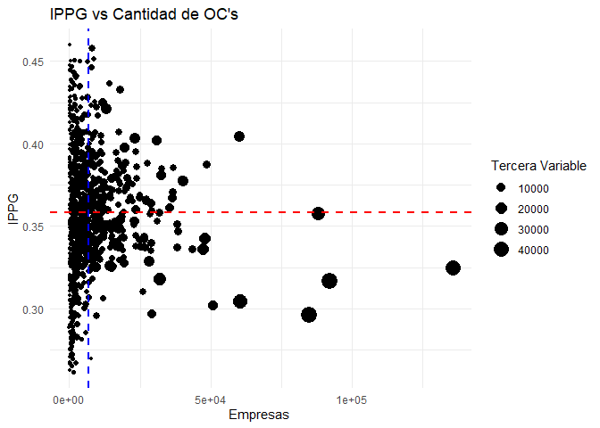

Índice de Participación con Perspectiva de Género
================

## GitHub Documents

This is an R Markdown format used for publishing markdown documents to
GitHub. When you click the **Knit** button all R code chunks are run and
a markdown file (.md) suitable for publishing to GitHub is generated.

## Including Code

You can include R code in the document as follows:

``` r
(
  ind_inst_plot = ggplot(datos_ind_fil, aes(x = total_oc, y = indicador, size = total_n)) +
    geom_point() +
    geom_vline(xintercept = mean(datos_ind_fil$total_oc), linetype = "dashed", color = "blue", size = 1) +
    geom_hline(yintercept = mean(datos_ind_fil$indicador), linetype = "dashed", color = "red", size = 1) +
    labs(title = "IPPG vs Cantidad de OC's",
         x = "Empresas ",
         y = "IPPG",
         size = "Tercera Variable") +
    theme_minimal()
)
```

    ## Warning: Using `size` aesthetic for lines was deprecated in ggplot2 3.4.0.
    ## ℹ Please use `linewidth` instead.
    ## This warning is displayed once every 8 hours.
    ## Call `lifecycle::last_lifecycle_warnings()` to see where this warning was
    ## generated.

<!-- -->

``` r
# (
# ind_inst_plotly = ggplotly(ind_inst_plot)  
# )
```

## Including Plots

You can also embed plots, for example:

<!-- -->

Note that the `echo = FALSE` parameter was added to the code chunk to
prevent printing of the R code that generated the plot.
